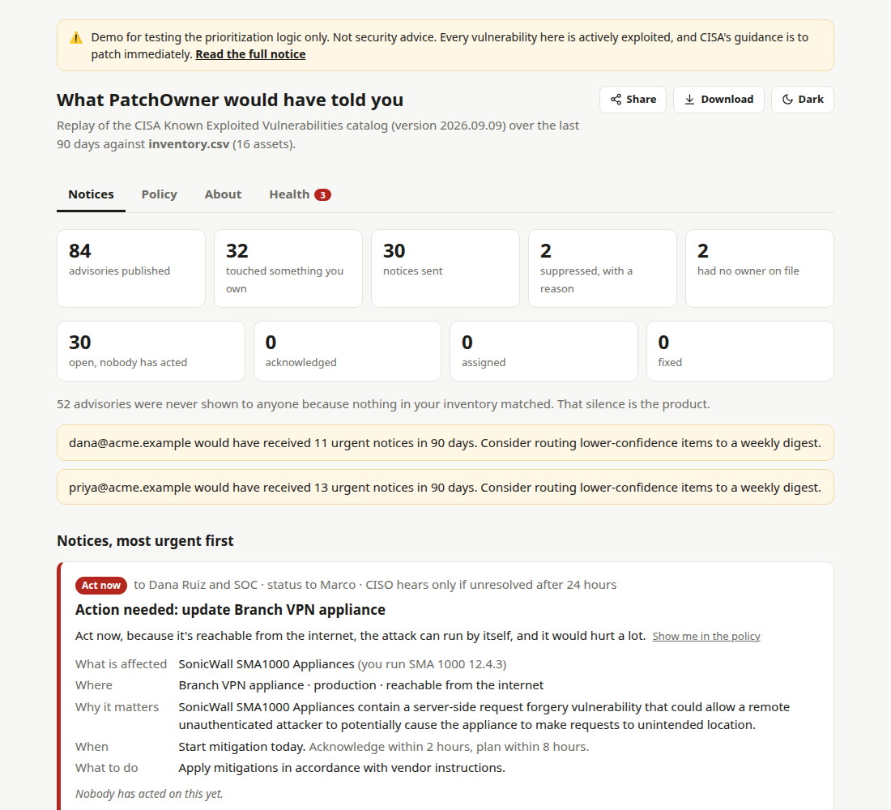
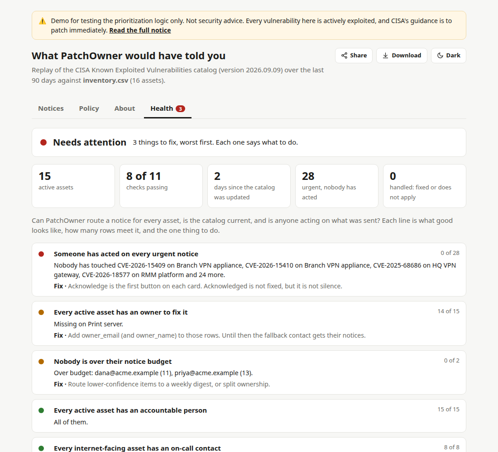
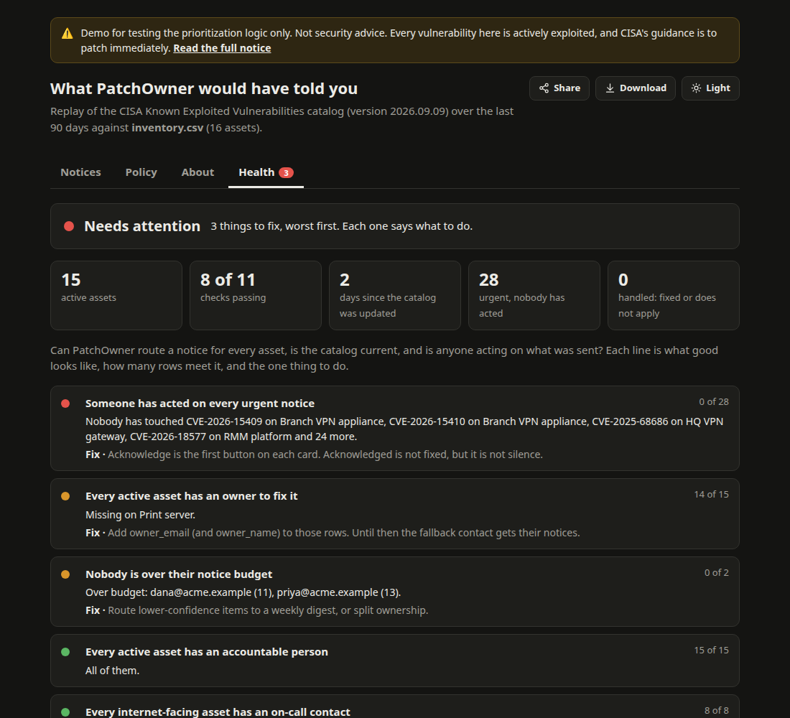
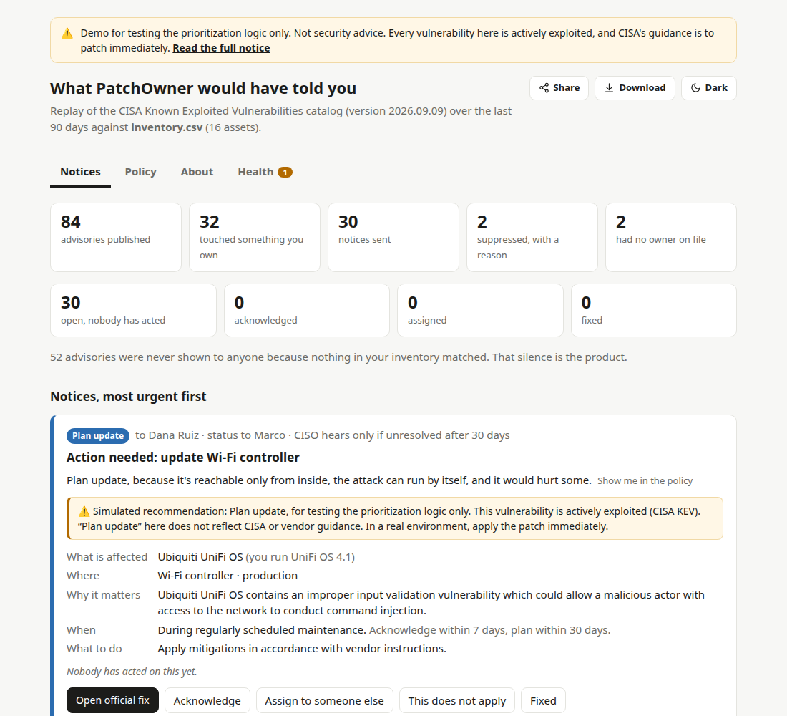
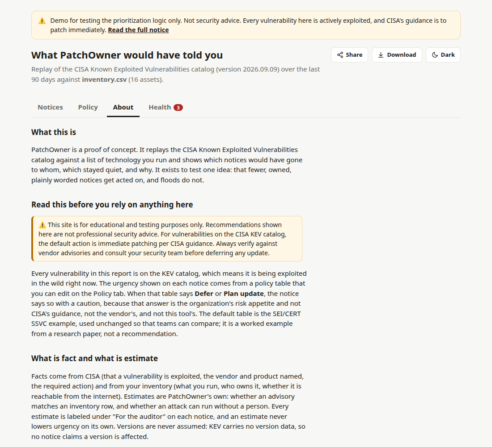

# PatchOwner

**Only verified, relevant, actionable vulnerability notices, routed to the person who can act.**

Upload a list of the technology you run. PatchOwner replays the CISA Known Exploited Vulnerabilities (KEV)
catalog over the last 90 days and shows exactly which notices would have gone to whom, which stayed quiet,
and why. The decision is an SSVC deployer tree you can edit by clicking. Every notice has working buttons.
A Health tab says whether the inventory is good enough to route on.

This is a proof of concept. It runs locally, needs no accounts, and touches no production systems.

**Live demo:** [patchowner.com](https://patchowner.com) is the report for `examples/inventory.csv`, no install needed.

> ⚠️ **For educational and testing purposes only.** Recommendations shown are not professional security advice.
> For vulnerabilities on the CISA KEV catalog, the default action is immediate patching per CISA guidance.
> Always verify against vendor advisories and consult your security team before deferring any update.
> Where the policy answers **Defer** or **Plan update**, the report says so inline, labeled as a simulated
> recommendation for testing the prioritization logic. The full notice is on the report's About tab.

| Notices, most urgent first | Health: can every asset be routed? |
|---|---|
|  |  |

Dark mode follows the system and can be pinned with the button in the top right.



When the policy answers Defer or Plan update, the notice carries the caution inline. The About tab holds the full notice.

| Inline caution on a slow answer | About tab |
|---|---|
|  |  |

## Run it

```
uv sync
uv run patchowner replay examples/inventory.csv        # writes out/report.html, open it in a browser
uv run patchowner serve                                # http://127.0.0.1:8000, upload a CSV
uv run pytest                                           # 86 tests, including the five routing scenarios from the design doc
uv run patchowner replay examples/inventory.csv --policy my_policy.csv   # your own risk appetite
```

The KEV feed is downloaded once to `data/kev.json`. Add `--refresh` to re-download.
Needs Python 3.12 or newer and [uv](https://docs.astral.sh/uv/).

## What is in the report

Four tabs, one page, no server needed once it is written.

**Notices.** Every notice that would have been sent, most urgent first. Each card says who gets it, one
plain sentence for why, what is affected, where, when, and what to do. Five buttons: open the official fix,
acknowledge, assign, this does not apply, fixed. Below the cards: who would have heard from us and how much,
what the accountable people see (one status line, no CVE numbers), and every suppressed notice with its reason.

**Policy.** The whole policy in five or six plain sentences, then the SSVC tree with the replay's counts on
every branch. Change an answer and every card, badge, and sentence recomputes. The edited policy CSV appears at
the bottom, ready for `--policy`.

**Health.** Can PatchOwner route a notice for every asset, is the catalog current, and is anyone acting on
what was sent? Eleven checks, worst first, each with a count and the one thing to do:

- owner, accountable person, on-call contact (internet-facing assets), and escalation contact on every active asset
- every row parsed cleanly, versions recorded
- no exception expired, none ending within 30 days, retired assets stay quiet
- KEV catalog no older than 7 days
- someone has acted on every Act now and Update soon notice, nobody over their notice budget

Health never changes a decision. It tells the person running the replay where the inventory or the follow-through is thin.

**About.** What the tool is, the full disclaimer, what is fact and what is estimate, credits, license.

**Share, Download, theme.** Share copies a one-paragraph summary (and the page address, when there is one) or
opens the system share sheet on phones. Download saves the report as one HTML file. The theme button switches
light and dark; the choice is remembered in that browser.

## Inventory CSV

Required columns: `asset`, `vendor`, `product`.

Optional: `version`, `environment` (production/staging/test), `internet_exposed` (yes/no),
`criticality` (low/medium/high/critical), `owner_name`, `owner_email`, `team`, `accountable`, `oncall`, `escalate_to`,
`status` (active/retired), `exception_until` (YYYY-MM-DD), `exception_reason`,
and two SSVC overrides: `exposure` (small/controlled/open) and `human_impact` (low/medium/high/very high).
See `examples/inventory.csv`.

## How a notice is decided

The decision is an SSVC deployer tree: Stakeholder-Specific Vulnerability Categorization, from the
SEI/CERT at Carnegie Mellon (Spring et al., version 2.0, April 2021; the paper is in `docs/`). Four fixed
questions, in order, then an answer that the organization owns.

| Decision point | Values | Where PatchOwner gets it |
|---|---|---|
| Exploitation | none, public poc, active | Always `active`: every KEV entry is exploited in the wild. Fact. |
| System Exposure | small, controlled, open | `exposure` column if set; else `internet_exposed` yes means open, otherwise controlled. |
| Automatable | no, yes | Always `yes`, the worst case. If the advisory text mentions authentication, user interaction, or local access, the notice carries a question for a person; only a person's confirmation moves it to `no`. An estimate never lowers urgency on its own. |
| Human Impact | low, medium, high, very high | `human_impact` column if set; else non-production is low, otherwise from `criticality`. |

The leaf is one of `defer`, `scheduled`, `out-of-cycle`, `immediate`, shown to people as
Defer, Plan update, Update soon, Act now. The default policy is the SEI example tree, unchanged
(`patchowner/policies/deployer_default.csv`, 72 rows). The vocabulary is fixed so teams can compare;
the outcome on each row is the risk appetite and is meant to be edited.

Then PatchOwner adds what SSVC leaves out:

1. **Match** the advisory's vendor and product to each inventory row. Tiers: exact, likely, possible.
   KEV has no version data, so no notice ever claims a version is affected. A `possible` match gets no
   policy path; the owner is asked "does this apply?" instead.
2. **Route to three people, three ways.** The fixer (`owner_email`, or the fallback contact) gets the full
   notice; on Act now, `oncall` joins them. The accountable person (`accountable`) gets one status line
   per asset with no CVE numbers or descriptions. The escalation contact (`escalate_to`) hears nothing
   unless the window passes. Act now means acknowledge within 2 hours, plan within 8, escalate after 24;
   Update soon is 2 days, 7 days, 7 days; Plan update is 7, 30, 30. That table is the other half of the
   policy and sits under the tree.
3. **Suppress** with a visible reason when the asset is retired, has an exception on file, or the policy
   says defer. Every suppression appears under "Why was this not sent?"
4. **Budget.** If one person would receive more urgent notices than the budget, the report says so.
5. **Follow through.** What people did is kept in a small JSON file (`out/state.json`, or `--state`), with
   full history under "For the auditor." Acknowledged is not remediated: only fixed and does-not-apply count
   as handled. "Does not apply" feeds back: the next replay suppresses that notice and shows the person's
   reason. In `serve` mode the buttons write to the server; in the static report they fall back to the
   browser's own storage.

Every notice shows one plain sentence: "Act now, because it's reachable from the internet, the attack can
run by itself, and it would hurt a lot." The SSVC path, row, and vector string (for example
`SSVCv2/A:Y/E:A/H:H/Se:O/`) sit under "For the auditor." Facts and estimates are labeled separately.

## Deliberately not here yet

Jira and ServiceNow tickets, email and Slack delivery, overdue tracking against the acknowledge windows,
multi-tenant MSP views, KEV edit and retraction diffing, scanner integrations, and any AI-generated analysis.
Those wait for a paying pilot.

## Layout

```
patchowner/kev.py        feed download, cache, date window
patchowner/inventory.py  CSV parsing and validation
patchowner/matching.py   vendor aliases, normalization, confidence tiers
patchowner/ssvc.py       SSVC decision points, policy loading, assessment
patchowner/decide.py     outcome to urgency, routing, escalation, suppression, budget
patchowner/health.py     inventory coverage, exceptions, feed freshness, follow-through
patchowner/state.py      what people did about a notice, JSON file with history
patchowner/report.py     HTML rendering (templates/report.html), share text
patchowner/engine.py     one call that runs the replay
patchowner/cli.py        `patchowner replay` and `patchowner serve`
patchowner/web.py        upload form and the /act endpoint
docs/                     the SSVC v2 paper and screenshots
```

## Credits

- **Idea, doctrine, and product direction:** [e-allora](https://github.com/e-allora). The PatchOwner doctrine (the project was called PatchSignal until September 2026),
  the funnel, the routing principle, and the five routing scenarios come from their design document.
- **Implementation:** written with [Claude](https://claude.ai) (Anthropic), model Claude Fable 5.1, working in
  [Claude Code](https://claude.com/claude-code), September 2026. Claude wrote the code, tests, and this README
  under e-allora's direction and review.
- **Decision vocabulary:** SSVC version 2.0, Software Engineering Institute, Carnegie Mellon University
  (Spring, Householder, Hatleback, Manion, Oliver, Sarvapalli, Tyzenhaus, Yarbrough, April 2021).
  Default policy table from the CERT/CC SSVC repository, unchanged.
- **Exploited-vulnerability data:** [CISA Known Exploited Vulnerabilities catalog](https://www.cisa.gov/known-exploited-vulnerabilities-catalog).

## License

Business Source License 1.1. Free to read, run, modify, and use inside your own organization, for evaluation,
research, and non-production use. Not free to offer as a competing product or hosted service. Each version
converts to Apache 2.0 four years after release (Change Date 2030-09-11 for this one). See `LICENSE`, or ask
for a commercial license.
